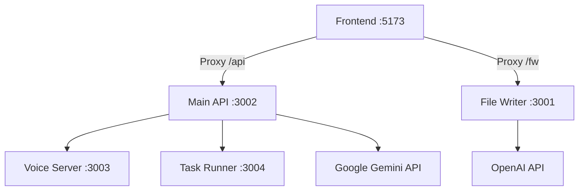

# 🚀 Development Startup Guide

## Quick Start

### Option 1: One-Command Startup (Recommended)
```bash
npm start
```
or
```bash
npm run dev-all
```
or on Windows, double-click:
```
start-dev.bat
```

### Option 2: Manual Individual Services
```bash
# Terminal 1 - Main API Server (port 3002)
npm run server

# Terminal 2 - File Writer Service (port 3001)  
npm run file-writer

# Terminal 3 - Voice Server (port 3003)
npm run voice-server

# Terminal 4 - Frontend Dev Server (port 5173)
npm run dev

# Terminal 5 - Task Runner (port 3004)
npm run runner
```

## 🌐 Service Architecture

| Service | Port | Icon | Description | Key Features |
|---------|------|------|-------------|--------------|
| **Frontend** | 5173 | 🌐 | Vite React Frontend + Proxy | Voice Gantt UI, Real-time updates |
| **Main API** | 3002 | 🚀 | Document Registry + AI Routing | Voice Intent Processing, MEGA SPEC |
| **File Writer** | 3001 | 💾 | File Persistence + OpenAI | Whisper, GPT-4o-mini integration |
| **Voice Server** | 3003 | 🎤 | Speech Processing | Croatian Voice Commands |
| **Task Runner** | 3004 | ⚡ | Background Task Processing | Async operations, queue management |

## 🎯 Service URLs

Once started, you can access:

- **🌐 Main Application**: http://localhost:5173
- **🚀 API Documentation**: http://localhost:3002/api/documents
- **💾 File Writer Status**: http://localhost:3001/status
- **🎤 Voice Server Health**: http://localhost:3003/health
- **⚡ Task Runner Dashboard**: http://localhost:3004/status

## 🎤 Voice Gantt Features

### Supported Croatian Commands:
- `"Agent"` - Activate Focus Mode
- `"Pomakni KIA 7 za 3 dana naprijed"` - Shift task forward
- `"KIA 7 i 334 blokirano"` - Set multiple tasks as blocked  
- `"Dalje"` - Exit Focus Mode and save changes

### MEGA SPEC Implementation:
- ✅ Strict tool definitions (`emit_action`, `ask_clarify`)
- ✅ Croatian normalization ("KIA 7" → "KIA7")
- ✅ Batch operations support
- ✅ Ghost preview visualization
- ✅ Custom badge system

## 🛠 Development Features

### Real-time Logging:
- Color-coded service identification
- Timestamp tracking
- Error/warning highlighting
- Process status monitoring

### Auto-restart on Changes:
- Frontend: Hot Module Replacement (HMR)
- Backend: Manual restart required

### Environment Variables:
```env
VITE_GOOGLE_AI_API_KEY=your_gemini_api_key
OPENAI_API_KEY=your_openai_api_key
VITE_LM_STUDIO_URL=http://10.39.35.136:1234
VITE_OPENWEBUI_URL=http://localhost:8080
```

## 🐛 Troubleshooting

### Common Issues:

1. **Port Already in Use**
   ```bash
   # Kill processes on specific port
   npx kill-port 3002
   npx kill-port 5173
   ```

2. **Module Import Errors**
   ```bash
   # Clean install
   rm -rf node_modules package-lock.json
   npm install
   ```

3. **Voice Intent 500 Error**
   - Check server is running on port 3002
   - Verify proxy configuration in vite.config.js
   - Restart frontend dev server after proxy changes

### Process Management:
- **Stop All**: `Ctrl+C` in the startup terminal
- **Individual Stop**: `Ctrl+C` in each service terminal
- **Force Kill**: `taskkill /f /im node.exe` (Windows)

## 📊 Service Dependencies



## 🎨 Log Format

```
HH:MM:SS ▶ START  🚀 Main API Server [3002] Starting Document Registry + AI Routing...
HH:MM:SS ✅ READY  🚀 Main API Server [3002] Ready at http://localhost:3002
HH:MM:SS ℹ INFO   🎤 Voice Server [3003] Croatian voice processing initialized
HH:MM:SS ⚠ WARN   💾 File Writer [3001] OpenAI API key not found - using mock responses
```

## 🔧 Advanced Configuration

### Custom Port Configuration:
Edit `start-dev.js` to modify ports:
```javascript
const processes = {
  frontend: { port: '5173' },
  server: { port: '3002' },
  fileWriter: { port: '3001' },
  voiceServer: { port: '3003' },
  runner: { port: '3004' }
};
```

### Service Selection:
Comment out services you don't need in `start-dev.js`:
```javascript
const startOrder = [
  'server',        // Always needed
  // 'fileWriter', // Optional: Comment to disable
  // 'voiceServer', // Optional: Comment to disable
  // 'runner',     // Optional: Comment to disable
  'frontend'       // Always needed
];
```

## 📈 Performance Monitoring

The startup script tracks:
- Process startup time
- Memory usage patterns
- Error rates per service
- Request throughput (via service logs)

Happy developing! 🎉